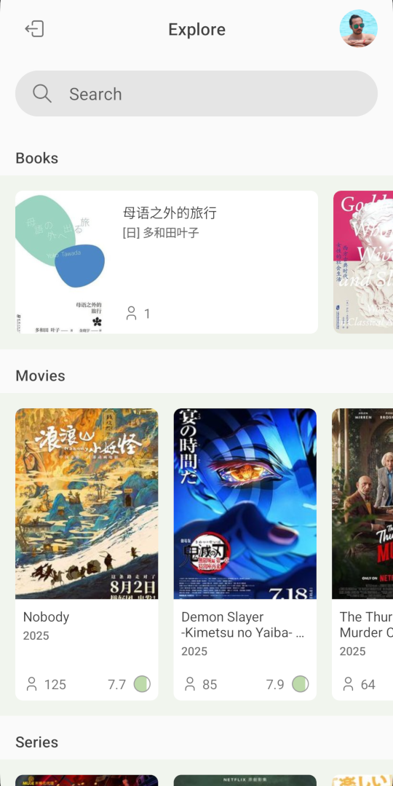
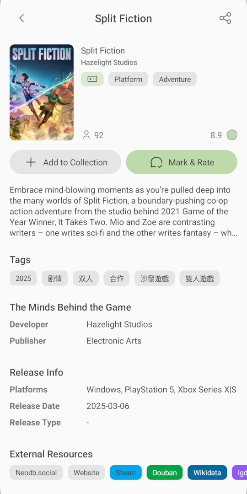
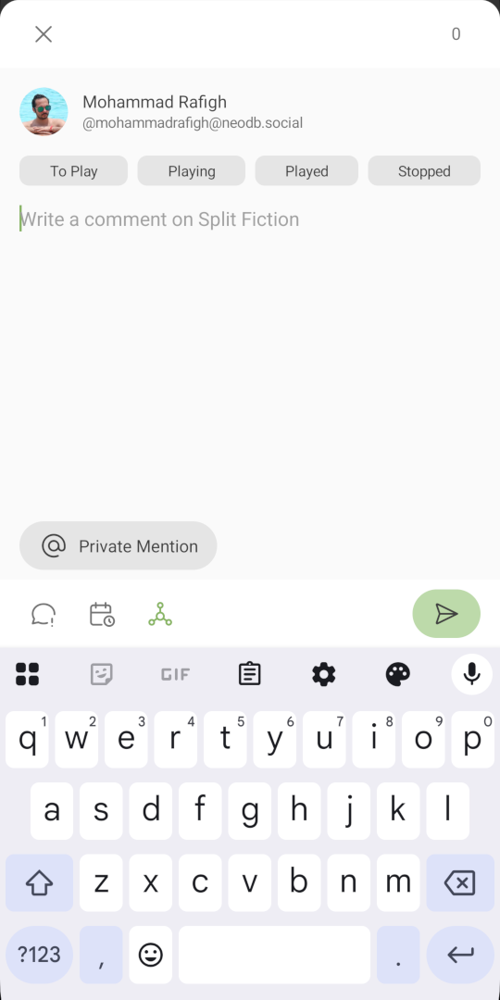
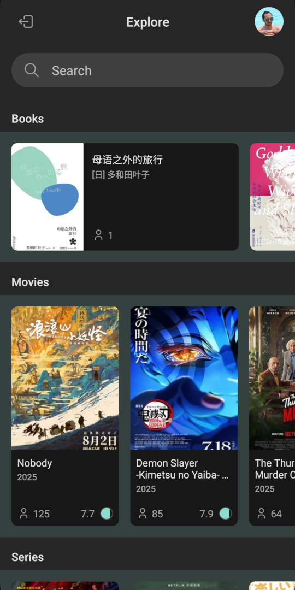
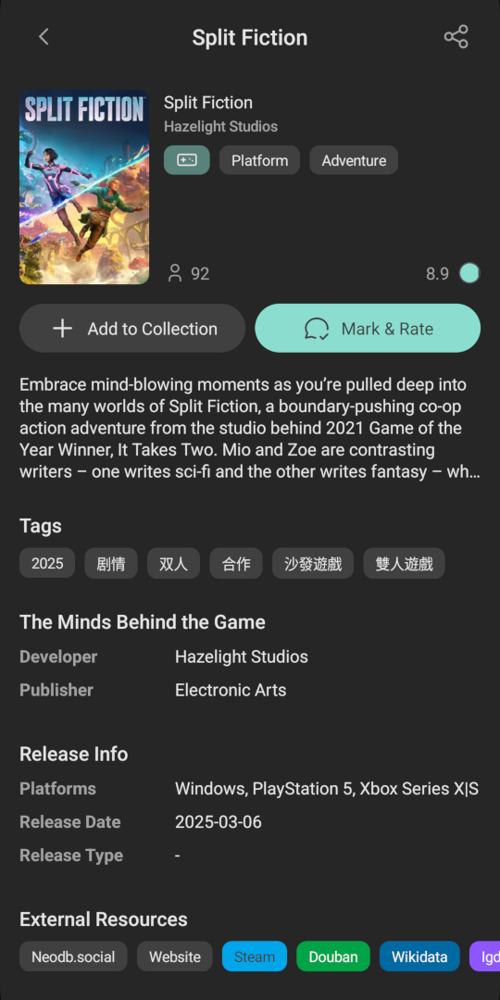
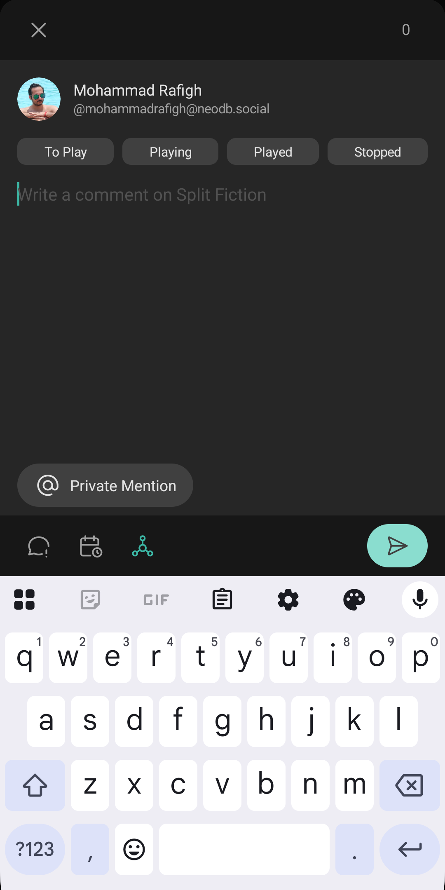

  

<h1 align="center">NeoComment - NeoDB Client</h1>

> [!WARNING]
> The project is still in its early stages. Please be aware of potential issues and report them back to us! 😉

> [!NOTE]
> The app will soon be available on F-Droid, but if you're curious, you can build it yourself.

NeoComment aims to provide an easy to use Android client for NeoDB - a federated user rating and review platform for books, movies, series, games, music, podcasts, and performances. You just need a NeoDB account on an instance to use NeoComment. To find an instance you can take a look at [NeoDB servers](https://neodb.net/servers/) or [FediDB](https://fedidb.com/software/neodb).

The project is powered by NativeScript, which means it may also have an iOS version in the future. However, the current focus is on Android.

  
  
  
  
  
  

## Upcoming Features
- Home (Profile): A page to view your ratings and reviews in one place.
- Feed: A section where you can see your friends' opinions on different items.

## Contributing
If you are interested in NeoComment and want to contribute, there are many ways you can help improve the project:

### Development
To develop the project, you need to have the following tools installed:
- Node.js and npm
- NativeScript CLI
- Android SDK

Then, clone the project and run `npm install` in the project root to fetch the dependencies.

To run the project in development mode, execute `ns run android`.

### Production Build
We use github actions to build for production. You can check actions to see how to build a production version, but here is a short guide:

`ns build android --release --env.snapshot --env.compileSnapshot --env.uglify --env.aot --key-store-path={keystore.keystore} --key-store-password={PASSWORD} --key-store-alias=neocomment --key-store-alias-password={PASSWORD}`

### Translations
You can help by translating the project to a language you speak at [Weblate](https://hosted.weblate.org/projects/neocomment/app/).

### Donations
First, I encourage you to donate to the maintainers of [NeoDB](https://github.com/neodb-social/neodb?tab=readme-ov-file#sponsor) as NeoComment wouldn't exist without their nice project.

If you'd like to support my work on NeoComment, feel free to donate using the cryptocurrency addresses below:

**BTC (Lightning):** mohammadrafigh@getalby.com

**BTC:** bc1qslhfja0qhq80csuuesuqmndrmx5hwu6n0z3tsw

**ETH:** 0x4EE3C20A875734c8f4400cf9De78df879FD96AD7

**LTC:** ltc1qn8dys7wh749cdrsxjw83zmhx5e7w8txrut50gn

**BCH:** bitcoincash:qr0sddp7gqvyuul5t8sj2qf30lcqkdk9eqj40avhz9

**XMR:** 8Aug1Nf8bar7h1mU29kMYXYU5DjWnnohkDmni3fZkoKWMRv8wJYHi2MTBrEq7VG1jrbqgAF6mAK3b12QdFMNXM7ySmSDBPJ

**ZEC:** u1tatygdm2y7qxajv0aeh9cmtsvvdjaharv6ysu4e9rszv3xyer32s0v6kgptuy8nfkvkl58s0s2dyhhdqdmjz2d9rxnu3t64ltup6xah2py4rmg8fjpwtjyza4jqlc2ttkdtf99umktz082w2yy7j7t5sz9mmltyy63pq5s23nappw0xvtmq437e709t5lv3u77vp0we3e6cpz7c5ur8

**XEC:** ecash:qpjgpk576exggjgd6zek8z9naxvcn3eeequc58h5yy

## Alternatives
There are other great apps available for NeoDB, such as [NeoDB You (Android)](https://github.com/heddxh/NeoDB-You/), [Piecelet (iOS)](https://github.com/lcandy2/neodb-app), [Chihu (iOS)](https://github.com/nunesdennis/Chihu), and [Fedicat (iOS)](https://codeberg.org/technicat/fedicat).
